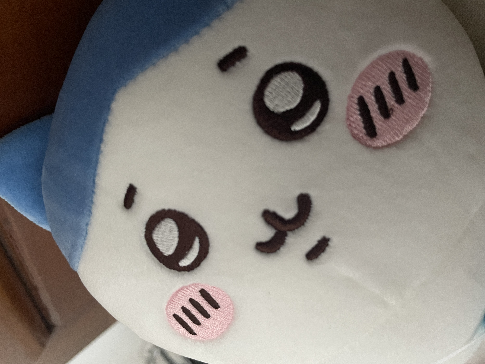

# 如何表达让英语更地道？

以下的所有收集均来自于笔者在教科书、考试与课外书籍之外的真实的欧美人日常使用的表达，对于较为正式的表达收录较少，更多聚焦于口语化表达和一些 [memes](https://www.wikiwand.com/en/meme).

---

**CRIT** --> short for **Critical hit**, 通常用在游戏中，意为**暴击**, 表达*暴击率*应该使用[**Crit Chance**](https://hypixel-skyblock.fandom.com/wiki/Crit_Chance), 这些表达都有固有说法, 因此我们应当尽量遵循, 不要凭空造词

---

**hit the gym** --> to visit the gym in order to exercise, 撸铁

**respawn** --> reappear after having been killed, 指在游戏中**复活**, *泉水*则叫做 **spawn camp**, *虐泉*则被叫做 **spawn camping**

**take a sip from ...** --> 小啜一口，尤其是咖啡之类的饮品

**lounge in ...** --> 设想在家中等舒适的环境中，沙发上随意的坐不像坐躺不像躺的姿势

**quintessential** --> representing the most perfect or typical example of a quality or class, 典型的

**fit in with the vibe** --> 指**符合氛围**，如果你想说不符合氛围也可以使用**doesn't fit the vibe**，英语在这一点上相当灵活

**Convenience store** --> 便利店，记住这两个词的组合，不要使用*convenient*和*shop*，这一点不得不说日语コンビニ简化得相当舒服

**instant noodles** --> 方便面，经常忘记怎么表达，只需要记住**即食面**

**hit or miss** --> 时好时坏，字面意思是*击中或错过*，表示结果好坏参半或运气的成分比较大。 The food is usually pretty hit or miss.

**insane** --> 这是表达**惊讶**时用得非常多的一个词，可以用来替代*crazy*，任何觉得**疯狂**的事都可以用 insane.

---

**clown** --> 小丑🤡，如果你需要表达中文互联网上的**小丑**的含义，应该使用这个词而不是*joker*，这两个词在美国文化下有着不同的含义: 

> The primary difference between a Joker and a clown is their purpose and characterization.
> 
> A clown is typically a comedic performer who entertains through physical comedy, slapstick humor, and visual gags. Clowns often wear colorful, exaggerated costumes and makeup to create a whimsical, childlike persona. The goal of a clown is generally to bring laughter and amusement to their audience, particularly children.
> 
> In contrast, a Joker is a character archetype associated with darkness, chaos, and psychological manipulation. Jokers are typically portrayed as unpredictable, calculating, and even sinister figures who use mischief and mayhem to achieve their own ends. Rather than eliciting laughter, the Joker often evokes a sense of unease, fear, or fascination in the audience.
> 
> While both clowns and Jokers may employ similar theatrical elements like makeup and costumes, the Joker is distinguished by their malevolent, anarchic nature and their desire to disrupt the social order, rather than simply entertain. The Joker is a complex, multifaceted character that has become a staple of many fictional universes, particularly in the realm of superhero stories and thrillers.

参考链接: [Difference between Joker and Clown](https://www.differencebetween.info/difference-between-joker-and-clown)

---

**plushie** --> 毛绒玩具，它与 *stuffed animal* 有着些许区别，*plushie* 是后面流行起来的说法，通常涉及到一些亚文化如游戏、动漫等各种媒体类型中的角色，**周边**的属性会更强，如下面的这两个: 

<figure markdown="span">
    <table><tr>
    <td>
        { width="250" }
        
<figcaption>Chikawa</figcaption>

    </td>
    <td>
        { width="350" }
        
<figcaption>Neuro-sama</figcaption>

    </td>
    </tr></table>
</figure>

---

**pumped** --> 虽然作动词的意思是*抽水*或者*泵*的意思，但是也可以用来表示**高兴**、**兴奋**。 I'm pretty pumped.

---

**bland** --> 如果你要形容食物、饭菜很一般、平淡没有特色，可以使用: The food is *bland* and boring.

*bland* 在这里的意思主要是平淡: 

> lacking strong features or characteristics and therefore uninteresting.
>
> (of food or drink) unseasoned, mild-tasting, or insipid.
>
> showing no strong emotion.

---

---
