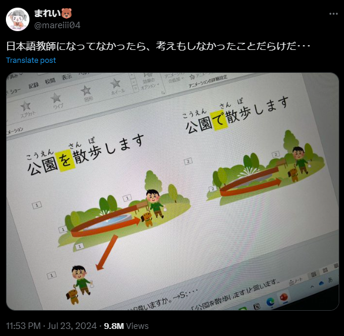
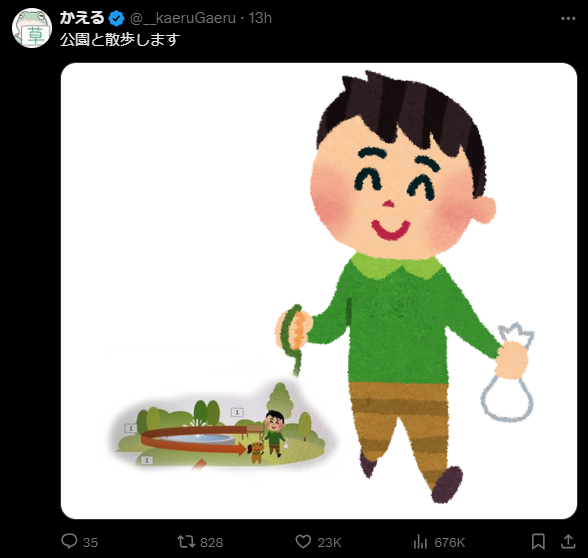

# 日本語纠错

最近刚考完了N2，发现自己虽然学了快两年的日语，听了很多也读了很多，语法词汇也见了不少，但是运用能力却很差，因此打算从语法和词汇运用上下些功夫，毕竟学习语言最快的方法就是用，而在这其中，又以造句最为高效，因此这个文档就是用来记录一些我完成的日语造句，并且分析其中错误的点，我相信我犯过的错误，也是很多典型的错误。下个月就要东渡日本了，希望在短暂的时间内，能够重新审视并整合一下过去一段时间内学习的日语，尽快适应日本的生活

<!-- more -->

本页面大部分的正确与错误的表达都进行了分开，并且通常错误答案会优先显示（如果有错误的话）意在在查看的时候先靠大脑思考一下正确的答案，然后再查看正确答案，如果立马就能看见正确答案的话，大脑就会在不经过任何思考的情况下认为“我已经懂了”，那这样的学习是没意义的

---

=== "表达“能”"

    私は毎日朝四時起きることができます。
    
    私は毎日朝四時起きられる。

这里`ことができる`是表达能力的固定表达，强调的是“能够”的事实，一般用在较为正式的场合

`起きられる`为可能型，更为口语化，从意思上面来看大体是可以交换的，但是要注意使用场合

---

=== "に和を"

    パソコンが泥棒に盗まれた。

    泥棒にパソコンを盗まれた。

前者表示强调`パソコン`这个对象，强调的是电脑被偷的事实

后者直接描述了`泥棒`这个动作执行者，强调的是偷窃的行为

---

=== "被害"

    子供はずっと泣いている。

    子供はずっと泣かれている。

后者使用被动态，含有被害的意思

---

=== "に和を"

    彼に買い物させる。

    彼を買い物に行かせる。

前者`彼に`强调了对象，让他去

后者强调的是“去”

---

**不断积累经验**

=== "❌"

    経験をずっと積もっている

=== "✅"

    経験を積み重ねていく

对于第一句，不应该使用`積もる`，这表示雪、灰尘等的堆积，对于抽象事物如经验、知识的积累，应该用`積む`，这里第二句使用`積み重ねる`这个连用形式

---

**请他来了**

=== "❌"

    彼を誘ってくれた

=== "✅"

    彼に来てもらった

第一句的`誘う`用于强调邀请的动作，不是单纯的请某人来，且`くれた`用于表示对方为自己做某事的谦虚表达，不是很符合原句意思，在这里`もらった`还有一层受益的含义。并且对于第二句，我想讨论的是其中`を`和`に`的区别，使用`を`的时候是动词直接作用于某个对象，而`に`则是表示动作的方向和间接作用对象，这一点在我之前对日语的学习中始终没有分清，不知道为什么用`に`。比如下面两句：

- 駅に行く
- 先生に質問する

这两句其实是一样的，但是之前我会认为这两句中的`に`表达的含义不一样。现在我们看第二句，我们「向」老师提问，而不是提问老师的「事」，因此这里带有方向性，对象是间接的，因为我们的最终目的是「问题」

---

**是有过那样一个人来着**

=== "❌"

    そういう一人のことがあるんだけど

=== "✅"

    そんな人がいたっけ

这句话的翻译是我一开始没正确理解其中文含义，所以造出了一个不伦不类的句子：

- 一人のこと不对
- `ある`在这里不合适，应该使用`いた`。因为我把意思理解成了一段时间了，主语不是人
- `んだけど`听起来像是未完成的句子，通常用来引出后续的内容，所以不合适

---

**这种事我能行吗？**

=== "❌"

    こんなこと私が行けるの？

=== "✅"

    こんなことは俺にできるかな？

表示能力的时候不能使用`行ける`，这个可能态表达的含义是「能去某地」或「能进行某个行动」，表示能力不太恰当

助词`に`的用法表示的是能力的对象，可以理解为「这种事情，可以，对我来说」

- この仕事は私にできますか？
- この問題は彼に解けるかな？

---

**妈妈昨天去买了东西**

=== "❌"

    お母さんは昨日買い物しました

=== "✅"

    母は昨日、買い物に行った

`買い物`的搭配是`買い物をしました`和`買い物に行きました`，其中前者更笼统，表示购物这个活动，而后者更具体，强调去购物的行为

---

**这个作品是由粘土制成的**

=== "❌"

    この作品は粘土で作成された

=== "✅"

    この作品は粘土で作られている

首先，`作成`这个词指制作文档、文件、报告等较为正式和抽象的东西，如

- レポートを作成する
- 計画を作成する

其次，`作られている`是被动语态的现在进行时或现在完成时，表示作品现在的状态是由粘土制成的强调材料和状态

---

**他可能不来了吧**

=== "❌"

    彼は来ないかもしれません

=== "✅"

    彼はたぶん来ないだろう

`かもしれません`表示一种不确定的可能性，语气较为温和，所以在这句话中就会没有特别强调「不来」的可能性，如果更确信某人不会来的时候，会使用`たぶん`＋`来ないだろう`来表达一种较为确定的推测

---

**听说他们俩最近要结婚了**

=== "❌"

    この二人は最近結婚しようとしているそうだ

=== "✅"

    二人は近く結婚するそうだ

首先`しようとしている`这种表达过于正式且复杂，不适合日常对话，正确的使用场景应该为：

「彼は仕事を始めようとしている」意思是某人正打算做某事，但是不一定已经开始或决定

此外，「最近」和`しようとしている`放在一起会显得有点重复和不自然，「最近」用来描述最近发生的事情，而`しようとしている`表示正在进行的打算和计划，这和中文的逻辑会有些不一样

因此，在这里使用「結婚するそうだ」来表达听说这个信息就可以了

---

**你看起来好像总是很忙**

=== "❌"

    あなたはずっと忙しいらしい

=== "✅"

    いつも忙しそうだね

`らしい`表达的含义更为间接，更倾向于「听说」，有听说和推测的含义，而`そう`表达的含义更为直接，表达了观察到的状态

`ずっと`和`いつも`也有区别，前者表示「一直」，而后者表达的是「总是」

---

**简直像雪一样**

=== "❌"

    まるで雪みたいだ

=== "✅"

    まるで雪のようだ

前者在口语中没有问题，但是在正式或书面表达中不够正式，`のようだ`是更正式和优雅的表达方式，适合于任何场合

---

**小王看起来想去国外旅游**

=== "❌"

    王さんは海外旅行をしようとしているみたいだ

=== "✅"

    王さんは海外旅行に行きたがっている

`しようとしている`表达的是「正打算做某事」，但不一定明确表达出这个行为的强烈意愿，且后面的`みたいだ`与之重复

连用形+`たがる`表示第三人称的欲望或意愿

---

**想让你回来**

=== "❌"

    あなたに帰ってさせたい

=== "✅"

    あなたに帰って来て欲しい

`させる`确实表达使役，让某人做某事，`させたい`看起来确实表示「想让某人做某事」，但是不适用于表达希望或想法

此外，因为中文和英文总是连着某些东西的缘故，我经常在日语中会忘记一些组成成分，比如这里：

- ❌ 帰って欲しい
- ✅ 帰って来て欲しい

前者错误的原因是表达的意思不完整，仅有希望某人「回去」，但是回哪去呢？并没有指明，因此`帰って`的对象可以是任何地方，但是我们中文使用者可能就会忽略掉这个地方；而后者则明确表明了，希望某人「回到说话人所在的地方」，强调「回来」的动作

---

**再过十分钟就会回来**

=== "❌"

    もう十分帰ってくる

=== "✅"

    あと十分もすれば戻ってくる

「もう十分」容易误解成「已经足够」，应该使用「あと」，在这个错误句中加上「で」来标示时间也可以

「もすれば」中使用「も」来强调，但是整体偏书面化

这里还有两点: 「戻る」和「帰る」的区别

- 「戻る」通常指返回到原来的地方
- 「帰る」通常指回家、返回到自己的住所或故乡

---

**传来了青蛙的叫声**

=== "❌"

    カエルの声が届いた

=== "✅"

    カエルの鳴き声が聞こえてきた

错误的用法中使用了「届く」，通常表示声音、消息等到达某地，语法虽然是正确的，但是给人的感觉更像是从某个特定的地方传来声音

而「聞こえて来た」表示「听得到」并且有「声音传过来」，强调了声音逐渐进入听觉范围的过程，因此更加准确地描述听到青蛙叫

---

**跑的话能赶上**

=== "❌"

    走ったら間に合う

=== "✅"

    走れば間に合う

这个句子的关键在于对「走ったら」和「走れば」的理解

- 「走ったら」强调的是**假设**，因为它本身就是由「走った」和假定型「たら」组合起来的。暗示在某个特定条件下，某个结果会发发生。“**如果**跑的话，能赶上”
- 「走れば」表达在某种情况下会出现的必然结果，带有更强的条件和因果关系，语气更为确定。
“**只要**跑就能赶上”

---

**性能好设计也不错**

=== "❌"

    性能が良いしデザインもいいだ

=== "✅"

    性能も良ければデザインも良い

前者使用「し」来列举多个事实或理由，更口语化，但是通常省略「だ」

后者使用「〜も〜ば〜も」句型表达“既...又...“

---

**灯光一暗下来，电影就开演了**

=== "✅ 一般规律"

    ライトが暗くなったら、映画が始まる

=== "✅ 回忆特定事件"

    暗くなると映画が始まった

前者使用过去形的「暗くなったら」和现在时的「始まる」，强调了条件（灯光变暗）和后续动作（电影开始）的因果关系，本身没有问题，但是通常用于描述某个事件的**预定程序**，比如“在夏天，天5点就亮了”

后者的「暗くなると」使用的现在时，和过去时的「始まった」，更像是在叙述过去发生的一次**具体事件**

---

**一上了年纪，记忆力就减退**

=== "✅ 过于正式"

    年を取ったら、記憶力が減退する

=== "✅ 口语表达"

    年を取ると記憶力が<ruby>鈍<rp>（</rp><rt>にぶ</rt><rp>）</rp></ruby>る

总体来说没有什么大问题，但相比之下「鈍る」更委婉和日常化

---

**不管刮风下雨每天都出去**

=== "✅ 决心"

    風も雨も構わず、毎日出かける

=== "✅ 语气强烈"

    雨が降ろうと風が吹こうと、毎日出かけていく

前者比较口语化，直接表达了对天气条件的无视；后者使用了「〜ろうと〜ろうと」句型，强调无论天气如何，行为都不会改变，语气比较正式，强调坚持不变的决心

---

**坐出租车回家了**

=== "✅ 直接"

    タクシーで家に帰ってきた

=== "✅ 强调过程"

    タクシーに乗って帰った

第二句使用「に」表示乘坐的对象，侧重于过程

---

**明明已经十二点了，却还没回来**

=== "✅ 强调时间的现状"

    もう十二時なのに、まだ帰ってこない

=== "✅ 强调时间变化过程"

    十二時になったのにまだ帰らない

「なのに」用来接在名词后面，「になったのに」强调的是时间的变化过程而不是时间的现状

总体来说两种说法都对，但是前者更加口语化，直接表达了失望或担忧

---

**又在写小说又在作诗**

=== "❌"

    小説を書いて、詩を作る

=== "✅"

    小説を書いたり詩を作ったりしている

前者语法没有问题，但是更多强调的是动作的并列关系，而不是动作的同时进行和持续状态

后者使用「〜たり」来列举动作，是较为常见的表达，使用「〜たり〜たりしている」表示列举多个动作，并强调这些动作是**交替**进行或**持续**的

---

**勉勉强强接受下来**

=== "❌"

    無理で受け取った

=== "✅"

    イヤイヤながら引き受けた

前者使用的「無理で」表示的意思是“不合理”或“勉强”，通常「無理」用来形容无法做到或不切实际的情况，不用于描述接受某事的态度，因此这里使用的并不准确

「イヤイヤ」表示“不愿意”或“勉强”，符合情景

另外一个区别是「受け取る」和「引き受ける」的用法和含义

「引き受ける」侧重于”*接收*“具体的物品、信息或感知，强调接受动作的完成，比如

- 荷物を受け取る
- メッセージを受け取る
- お礼を受け取る
- その言葉を受け取る

而「引き受ける」侧重于“*承担*”任务、责任或义务，强调对某项工作或责任的接纳和负责

- プロジェクトを引き受ける
- 責任を引き受ける
- 仕事を引き受ける

---

**如果来日本，希望能到我家来玩儿**

=== "✅ 日常对话"

    日本に来たら、うちに遊びに来てほしい

=== "✅ 书面表达"

    日本に来るなら家に遊びに来て欲しい

上面两种表达都是对的，但是稍微有一点区别，这里我想重新梳理一下「たら」和「なら」的区别

对于这样一个结构: 

x(たら)(なら)y

x, y分别表示前后的两个事件

「たら」更加侧重于描述条件发生后的**结果**y，因此 xたらy 表示*做了 x 之后，y*

「なら」更加侧重于建议、和假设性**推测**x，因此 xならy 表示*要做 x 的话，y*

对于结果发生的反事实的情况，我们根据上面的逻辑也能推断出两个表达的区别

- 先週、神戸に来ていたのなら、案内してあげたのに（因为不知道来了，所以没带）
- 先週、神戸に来ていたら、案内してあげたのに（因为没有来，所以没有带）

---

**他就是有病**

=== "❌"

    彼は病気がある

=== "✅"

    彼は病気なのだ

我们先来看一下错误的句子，这里犯错的典型是套用了中文的逻辑，然而日语中形容“有病”并不会使用「がある」，而是直接使用「病気だ」

另外，这里为了表示强调，使用「なのだ」来**断定**确实有病

---

**不是来玩儿的，是来工作的**

=== "✅ 口语表达"

    遊びに来てじゃなくて、仕事なんです

=== "✅ 正式表达"

    遊びに来たのではなくて仕事できたのだ

虽然第一句没有错，但是可能是因为接触的口语化表达较多，让写正常句子的时候反而写不出来了

这里解释一下正式表达中使用到的两个「の」: 

- 第一个「の」用在动词「来た」后面，把动词短语名词化，让前面的部分成为「のではなくて」的主语部分，用于对某个事实或情况进行解释或强调，「のではなくて」相当于“不是...而是...”
- 第二个「の」跟上一个例子使用的「のだ」有点类似，表示“是因为...所以...”或者“是为了...”，用来**解释**原因或**强调**某个事实

---

**就因为是你一个人做的，所以才来不及**

=== "✅ 普遍事实"

    あなた一人がやるので、間に合わない

=== "✅ 结果"

    一人でやったのだから、間に合わなかったのだ

上面两种说法都是对的，但是适用于的情况略有区别，我们只需要弄清楚下面这两处关键构件的差别就能感受到这两句话的细微差别

- 「が」和「で」: 「が」用来标记主语，突出的是**你一个人**，「で」表示动作的手段或方式因此突出的是**以一个人的方式**，仔细想想还是有些区别的
- 「ので」和「のだから」: 「ので」是带有较为客观的陈述语气，「のだから」更加主观，强调前提条件和结果的因果关系

现在我们再来看，感觉第一句像是对一个人的告诫，提示他，你一个人做不完，所以要注意一下；而第二句则是事后分析原因，你来不及的原因是因为你只有一个人做

---

**我的爱好是看电影和喝咖啡**

=== "✅ 但是不自然"

    私は趣味は映画を見ることとコーヒーを飲むこと

=== "✅ 自然的表达"

    私の趣味は映画を見ることとコーヒーを飲むことだ

这里我犯的错误是重复使用了「は」，虽然在语法上没有错误，但是显得不自然，日语中通常会避免在一个句子中重复使用主题标记「は」。之所以我会这么造句的原因，大概率还是受这一句话的影响: 

> 彼は背が高い

这句话的主题是「彼」，为了描述他个子高，使用了「背が高い」，符合日语的表达逻辑

但是，日本人其实并不会特别在意这一点，如就这个问题我就专门问过我的日本人老师，她认为「彼は背が高い」和「彼の背は高い」没有什么区别

因此我们作为非母语者，也不必在这些细枝末节上钻牛角尖，语言能让人理解是第一位的

---

**我看到田中先生正在跑步**

=== "✅ こと"

    田中さんが走っている**こと**を見た

=== "✅ の"

    田中さんが走っている**の**を見た

两种表达都算正确，但是有些时候「こと」和「の」不能相互替换，一般情况下「の」所表达的语境更随意，「こと」更为正式

但是两者在**抽象性**和**具体性**上是不能混用的

「の」更倾向于强调**具体**的行为和状态，及更加关注具体的事情发生了什么，常用语描述**个人**的感受、实际发生的事情或具体情况，如

- **彼がくるのが見えた** --> 强调看到的具体情况
- **走るのは楽しい** --> 强调跑步这一具体的活动

「こと」常用语表达普遍性的事情、概念或真理，适用于更广泛的概念，可以指代整个事情的抽象概念

- **彼が来ることがわかった**　--> 强调知道这一事实的整体情况
- **走ることは健康に良い**　--> 强调跑步这一抽象概念的益处

所以重新审视一下刚才的这句话，我们可以发现两者混用并没有多大差别

---

**去过几次中国**

=== "❌"

    中国に行ったことは何度ある

=== "✅"

    何度か中国に行ったことがある

错的这句表达的顺序受中文影响太大，应该将「何度」提前，然后用「か」来表示并不清楚具体“几次”的意思

---

**我在那附近散过步**

=== "❌"

    そっちの隣で散歩することがある

=== "✅"

    あの辺りを散歩することがある

「そっちの隣」一般用于指向具体的某个特定的方向或对象，而不是不确定的某个区域，「あのあたり」表示“那一带”或附近的意思，指代一个不确定但相对较大的区域

随后就是「で」和「を」用法的差别，我们知道「で」确实能够提示在某个地方，但是这里的用法则有些区别，在之前的「公園を散歩します」中见过

<figure markdown="span">
    <table><tr>
    <td>
        { width="300" }
    </td>
    <td>
        { width="300" }
    </td>
    </tr></table>
</figure>

「を」相当于在公园里转了一圈，强调的是整个过程，有点像 “跑个步” “洗个澡” 的语感

---

**决定后天去见他**

=== "✅ と決めた"

    明後日彼と待ち合わせると決めた

=== "✅ ことにした"

    明後日彼に会うことにした

两种说法都对，其中「待ち合わせる」用于表示约好时间和地点见面，强调了见面的安排，这里稍微对「待ち合わせる」和「打ち合わせる」作一下区分: 

**待ち合わせる** --> 指的是事先约好时间和地点与某人会面，有 “约定见面” 和 “约会” 的意思，强调的是**见面**动作本身，不一定涉及见面的目的

- 友達と駅で待ち合わせる
- 待ち合わせの時間に遅れた

**打ち合わせる** --> 指的是**商讨**和**商议**，通常用于指事先商量某事的具体内容、细节等，更侧重于沟通和商讨的过程

- プロジェクトの詳細を打ち合わせる
- 明日の打ち合わせの準備をする

另外，做决定用得更多的是「ことにする」，我们用「こと」来表示抽象的事情，「に」用来指方向，因此连起来就是 **要做** --> **某件事** 

也就是决定，语感表现为强调经过思考后作出的决定，比较主观，反应了说话者的主观意愿和决定，表达了内心的某种决定性

---

**坚持不喝酒**

=== "❌"

    お酒を飲まないと持っている

=== "✅"

    酒は飲まないことにしている

实在想不起来在日语中如何表达**坚持**，实际上日语并不会用一个特定的动词来表示坚持，而是使用意志和事态来表现坚持这种行为

和上一个句子相似的地方是，同样使用了「ことにする」的变体形式，我们将这样一个**决定**使用进行时，则表现了一直以来的决定，即**习惯**，也就是长期坚持

表达坚持 --> 「ことにしている」

---

**不必特别着忙**

=== "❌"

    特に忙しい必要はない

=== "✅"

    別に急ぐことはない

这个句子有两个重要的点: 

1. 「特に」和「別に」
2. 「忙しい」和「急ぐ」

「特に」表示某件事物在众多事物中尤为突出或特别，其实在这里用得并没有什么问题

「別に」表示并不特别，并没有什么，通常用于否定句中，比如动画男主角经常会说的「別に」其实就是省略后的一种表现，在这个句子中则需要和后面的否定组合在一起来达成含义，并不是双重否定

对于错误的句子，其实就错在「忙しい」，它指的是工作、生活等方面的**繁忙**，而不用于表达**着急**的意思

---

**不能罢休**

=== "✅ 劝诫"

    そのまま諦めることはない

=== "✅ 决心"

    やめることができまい

「ことはない」表达的意思是“没有必要”或“不会”，给人的感觉是 “没有必要放弃这件事，因为它并不难” ，传达了一种劝诫或建议的语气，暗示还有其他选择和方法，语气较为温和

「ことができない」则表现的是一种能力，强调无法或不可能放弃，因此传达的是一种强烈的决心，表明了“不能罢休” “不能放弃”的态度

---

**听说樱花已经开了**

=== "✅ 听说"

    桜がもう咲いているそうです

=== "✅ 得出结论"

    桜はもう咲いたということだ

两个句子都没问题，但是看一下第二句「ということだ」通常用来总结前面的事实或传达间接消息，语气略显正式

---

**最好还是自己做**

=== "❌"

    自分がやるほうがいい

=== "✅"

    やはり自分でやることだ

又一次出现「が」「で」之争

「が」的感觉就像: 这件事是由(谁)做的。是谁都行，没有太大差别

「で」的感觉就像: 这件事还得由我**亲自**做，别人做都不行，或者我亲自做而不依赖他人 的这种语感

---

**真是件麻烦事呀**

=== "✅ 感叹"

    本当に面倒なことだよなぁ

=== "✅ 不满"

    全く面倒なことだ

这两句的主要区别就是「本当に」和「全く」两者的区别

「本当に」强调的是某事的真实性，表达感叹，语气比较温和中性，使用范围比较广

「全く」表示某件事物或情况的全部，可以用来否定，在否定句中可以表达强烈的不满或惊讶

---

**那天平安无事**

=== "✅ 安全"

    その日は安全で無事

=== "✅ 并无特别"

    その日はことなく過ぎた

两种表达都是对的，只是侧重点不一样，其中一些小细节提一下

第一句使用「で」来连接两个形容动词，表示同时存在，相当于“而且”

---

**让人高兴的是，他好像对我也有好感**

=== "✅"

    嬉しかったのは、彼も私に好感を持っている

=== "✅"

    嬉しいことに、彼も私に好感を持ってくれたようです

两种说法都是正确的，但是分析一下第二句模范句的可圈可点之处: 

- 「ことに」是一种比较文雅的引出情绪或感受的表达，带入书面语，我们看书看到这种表达的那种感觉
- 「くれた」表示对方为说话者做的行为带有感谢的语气，带入这个句子确实是这么回事，两厢情愿能不高兴吗

---

**不早点出发的话天就要黑了**

=== "✅ 随意"

    早く出発しないと暗くなっちゃった

=== "✅ 正式"

    早く出発しないことには日が暮れてしまう

注意一下第一句「しないと」其实是「しなければならないと」的省略形式

第二句的表达使用了「ことには」，表示强烈的条件，**如果不先做A，就会发生B**

---

**这个游戏不仅知名度高，而且每年都会举办一次比赛**

=== "❌"

    このゲームは知名度が高いし、毎年一度試合を立てます

=== "✅"

    このゲームはその知名度もさることながら、年1回大会も開催されている

第一句错误的地方在于「し」用得不对和「立てます」的不合适

「し」用于表明前一个原因或事实，还会有其他原因或事实，这里并不是讲述原因，而是要表达递进关系

「試合を立てます」用得不自然，举办比赛更自然的用法是

- 大会を開催します
- 試合を行います

第二句使用了「もさることながら」来表达**不仅...而且**的含义，除此之外，还有一个「その」与之连用，个人感觉加上这个有一种强调、感叹的语感，这两种表达经常连用

---

**以前经常去啊**

=== "❌"

    昔よく行っただよなぁ

=== "✅"

    以前はよく行ったものだ

第一句错误的地方在于「だ」的使用，这里讲的是过去的习惯，有两种改法: 去掉「だ」或改为「だった」

还可以将「だ」改为「んだ」，为「のだ」的口语形式，用来提供背景信息、解释或强调前述的内容

「ものだ」为固定表达，通常用于表示过去的习惯、回忆或感叹

---

**昨天的演唱会，如果能去的话很想去**

=== "❌"

    昨日のコンテスト、できればすごく行きたい

=== "✅"

    昨日のライブ、行けるものなら行きたかった

错句有两个错误: 「コンテスト」用错了，本来想用「コンサート」的；「行きたい」应该改为「行きたかった」

除此以外，「コンサート」和「ライブ」也是有区别的，一个是正式的音乐会，偏古典，另一个偏流行

两句所表达的意愿也有不同: 

- 前一句的意愿并没有那么强烈，「できれば」就好像 *如果可以的话就去，其实也比较想去，但是去不了也没关系* 也没强调实现的难度，表达的是希望和**建议**
- 「行けるものなら」强调实现的难度，带有强烈的愿望和感叹，*如果能去的话，我真的很想去*

在这里使用的「もの」表现的是抽象的 *如果能去的这种条件或情况* 更大的作用是强调

---

**死有什么可怕的！**

=== "✅ 反问"

    死ぬのが何が怖いの！

=== "✅ 强调"

    死ほど怖いものか！

第一句是**反问**，表达对死亡的不屑

第二句才是感叹句，句子强调了死亡的恐怖性

---

**搬家后的这一周里，一直在整理行李**

=== "❌"

    引っ越したこの一週間、ずっと荷物を整ってる

=== "✅"

    引っ越ししてからのこの一週間、ずっと荷物の整理をしている

错误句子有两处需要注意: 「引っ越し」和「整ってる」

前面的两种不同说法都正确，为了表达 *搬家完之后* 的这段时间，可以使用「してから」这样的连用，来表示某个动作开始后的时间段

后面的动词用法则有问题

「整う」表示的是**整齐**或**准备好**，表示事物处于的一种状态，用进行时则表现的是这一种状态，而不是正在让事物变成整齐、完备的状态

- 部屋が整ってる
- このシステムは整ってる

而「整理している」则强调的是这一动作，这才是描述**正在进行**的整理过程或行为

---

**结婚后，花在兴趣上的时间就减少了**

=== "❌"

    結婚した後、趣味がかかる時間が減っている

=== "✅"

    結婚してからというもの、趣味に費やす時間が減って来ている

首先来看错误: 「趣味がかかる」这种说法不自然，「かかる」的用法经常为: 

- 时间、费用：時間がかかる、お金がかかる
- 疾病、陷阱等的影响：風邪にかかる、罠にかかる

为什么呢？因为「かかる」通常用在无意识或不具体指明对象的情况下使用，上面的这些例子就是**被动**或**无法支配**的场景。而爱好显然是主动参与的，并且由明确的时间和资源投入，因此下面的这两种表达更自然：

- 趣味に費やす時間
- 趣味にかける時間

另外，「あと」与「してからというもの」有一些细节上的区别，前者比较直接中性；而后者则还有强调 *自从某一件事开始后，情况有了**显著**的变化*

最后，正确的句子中使用了「来て」来强调趋势，指从过去到现在逐渐发生的变化。这种汉语中没有的说法在日语中非常常见，我们汉语母语者较容易忽略其意义

---

**开车去就好了...**

=== "✅ 惋惜"

    ドライブに行ったらいいのに...

=== "✅ 不满"

    車で行けばいいものを...

有点小问题: 「ドライブに行く」的意思是去**兜风**，并不是开车去某处

前者因为「のに」，表达比较温和，意为 *本来应该...* ，因此带有一种惋惜或遗憾的语气

后者使用「ものを」则带有责备、遗憾和抱怨的语气，表示 *要是...该多好啊* 或 *明明...却...* ，抱怨对方错过了一个本来更好的选择

---

**虽然可以开始说五十音了，但是说到写还是没什么自信**

=== "✅ 客观"

    五十音が話せるからと言って、書くのはあまり自信がない

=== "✅ 感叹"

    五十音は発音できるようになったものの、書けと言われたら自信がない

第一句使用「からと言って」表示尽管前面的事实成立，但后面却不一定有相应的结果，强调前后两部分的对比，较为客观中立

第二句使用「ものの」表达实际情况与期望的落差，带有一定的感叹、遗憾或无奈的情绪

这两个句子之间的差别可以挺明显得表现中日两种语言的差别

---

**不顾下雨，在倾盆大雨中奔跑**

=== "❌"

    雨がかまわず、土砂降りの中で走ってる

=== "✅"

    雨をものともせずに、土砂降りの中を駆け抜けていく

错句中应该将「が」改为「を」，其他并无大碍，但是就表达而言，第二句则更具体生动

第二句使用「ものともせずに」意为 *不屈于，不顾* ，带有强烈的意志力和决心，常用于描述英雄行为或坚定决心时使用

而「構わず」则语气较轻，用于日常生活中的不在意或不顾某事，可以表示一种轻松的态度，对某种情况的无视

「駆け抜ける」表示 *飞奔，穿过* ，这个「抜ける」非常形象，在日语中本身就有 *穿过狭窄的地方到对面* 的意思
