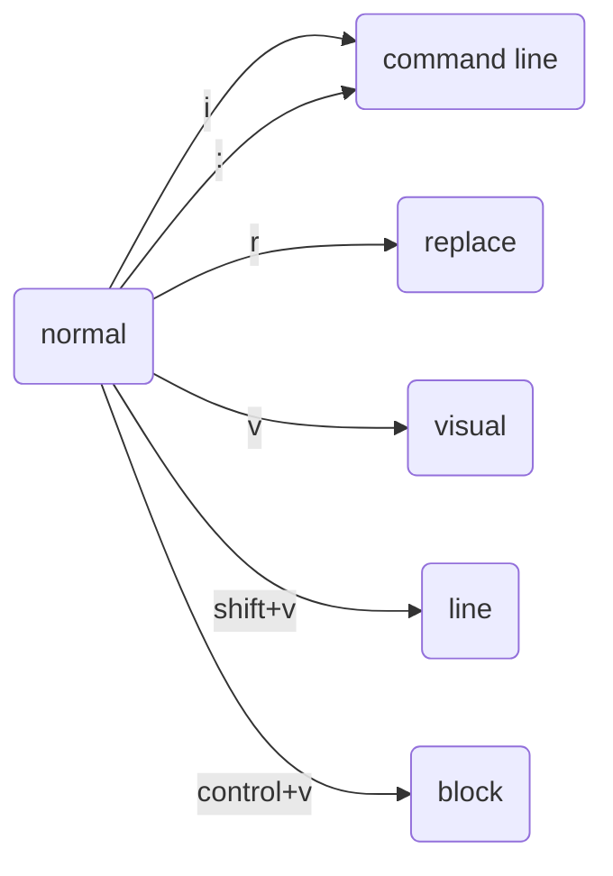

个人认为shell指令及脚本应当属于计算机的入门内容，这些较为底层的命令虽然不如高级语言那么容易明白，但好在常用的指令并不算多，而且对开发的效率及思维的广度有非常大的提升，可以说能写好shell，就掌握了Linux系统，对之后的开发有事半功倍的效果

## 环境变量

环境变量(environment variable) are things that are set whenever you start your shell, they are not things you have to set every time you run your shell

路径变量(path variable)`$`

```bash
echo $PATH
```


## 用户权限

首先应该了解的就是用户权限，我们在使用命令操作各种文件时，经常会碰到没有权限执行的情况，导致命令执行失败，然后经常会导致各种报错找不到原因，所以首先了解权限是非常有必要的事情，这里主要以Linux系统为例，macOS下的操作与Linux几乎没有差别

Linux系统是典型的多用户系统，那么既然有用户，用户之间也有不同的地位，所以也就有着不同的权限，比如`root`用户就是系统管理员，拥有系统的完全掌控权

通常使用这两个命令来修改文件或目录 (`file` and `directory`)的所属用户与权限：

- `chown`(change owner)：修改所属用户与组，`user` and `group`
- `chmod`(change mode)：修改用户的权限

`chown`用来给用户授权，`chmod`用来设置权限

使用`ls -l`查看当前目录文件权限

```shell
$ ls -l
total 192
-rw-r--r--@ 1 kiharari  staff   4787 Nov  9 15:13 Python抓取行政区划地理信息.md
-rw-r--r--@ 1 kiharari  staff  47617 Nov  8 13:44 districts.ipynb
-rw-r--r--@ 1 kiharari  staff    634 Dec 14 19:22 geocoordtrans.html
-rw-r--r--  1 kiharari  staff   1932 Dec 14 19:30 geocoordtrans.js
-rw-r--r--  1 kiharari  staff   1366 Dec 14 18:45 trans.js
-rw-r--r--@ 1 kiharari  staff   8259 Dec 14 19:46 地理坐标转换.md
drwxr-xr-x  6 kiharari  staff    192 Nov  8 13:41 津南区
-rw-r--r--  1 kiharari  staff  11469 Nov  8 13:43 津南区.json
-rw-r--r--  1 kiharari  staff    278 Dec 14 18:45 转换然后显示.html
```

如果你的英语足够ok的话，我建议学习下面的课程，它将包含基础的Linux命令的使用，其中还有对管道`|`的解释，使用简单命令控制系统底层的状态，如屏幕亮度等，通过这些简单的命令的组织来达成更复杂的操作

[https://ty-chen.github.io/linux-kernel-pipe/](https://ty-chen.github.io/linux-kernel-pipe/)

<center>
<iframe width="560" height="315" src="https://www.youtube.com/embed/Z56Jmr9Z34Q?si=iAPKTk9mTqBaY5_L" title="YouTube video player" frameborder="0" allow="accelerometer; autoplay; clipboard-write; encrypted-media; gyroscope; picture-in-picture; web-share" allowfullscreen></iframe>
</center>
`echo`用于显示，如果要显示的字符含有空格，可以有下面两种处理方法：

```bash
echo "hello world"
echo hello\  world
```

为了展示`echo`的真正威力，我们往往需要结合其他的命令，来形成一个复杂的命令，事实上，命令之间的组合能够实现很多的功能

```bash
echo hello  >  hello.md
```

这个命令将会创建一个`hello.md`的文件，并将`hello`内容写入文件，在使用这个命令后，终端并不会显示`hello`

```bash
cat  hello.md
# or
cat < hello.md
```

使用`cat`命令将会显示出`hello.md`文件中的内容，可以认为`cat`简单地复制了`hello.md`中的内容作为输出。如果你想通过`cat`进行复制，又不想用`cp`命令，可以使用如下的方法：

```bash
cat < hello.md > hello2.md
```

还可以使用`>>`作为附加而不是覆盖

```bash
cat < hello.md >> hello2.md
```

`|`pipe，作用是把程序的输出放在左侧，程序的输入放在右侧


```bash
sudo su
```

进入`root`


下面的这个视频会介绍shell工具和脚本的构建

<center>
<iframe width="560" height="315" src="https://www.youtube.com/embed/kgII-YWo3Zw?si=XfF6PtoRecXs_s9q" title="YouTube video player" frameborder="0" allow="accelerometer; autoplay; clipboard-write; encrypted-media; gyroscope; picture-in-picture; web-share" allowfullscreen></iframe>
</center>
`$_`这个符号可以将上一个命令作为参数的一部分

```bash
mkdir test
cd $_
```

加入你创建了一个`test`文件夹，然后在下个命令你可以直接使用`$_`来代指它，从而直接进行操作

**逻辑操作**

```bash
false || echo "Oops fail"
> Oops fail
```

`||`将会以OR的逻辑运行，如果左边的值为`false`，那么就会尝试运行右边的

```bash
true && echo "Things went well"
> Things went well
```

`&&`AND，如果左边的值为`true`，那么就会运行右边的，否则就不会运行

```bash
false;echo "This will always print"
```

使用`;`，无论是否正确，都会运行

**Command substitution**

`$()`可以用来做变量的替换，类似于python中的`{}`

```bash
echo "We are in $(pwd)"
```

这将会输出当前路径

**Process subtitution**

```bash
cat <(ls) <(ls ..)
```

这个命令将会打印出当前目录和父目录下的文件名，以无缝衔接的形式


**通配符**

如果我们想将`image.png`转换为`image.jpg`，可以使用下面的命令：

```bash
convert image.png image.jpg
```

我们也可以这样做：

```bash
convert image.{png, jpg}
```

对于这些接受多个参数的命令，我们都可以这样做，使得命令变得简洁，也可以用这种方法创建多个相似名称的文件：

```bash
mkdir project{1,2}
touch project{1,2}/test{1,2,3}.py 
```

这样我们就能快速创建两个`project1`, `project2`目录，并且分别在这两个文件夹下创建三个python文件了

```bash
mkdir foo bar
touch {foo,bar}/{a..j}
```

我们甚至可以以这样的方法进行遍历，按下`tab`⇥就可以自动展开，⚠️注意，**不要有空格！**

```bash
touch foo/a foo/b foo/c foo/d foo/e foo/f foo/g foo/h foo/i foo/j bar/a bar/b bar/c bar/d bar/e bar/f bar/g bar/h bar/i bar/j
```

然后我们就能得到这么多文件，现在我们再分别在这两个文件夹中加上两个不同的文件

```bash
touch foo/x bar/y
diff <(ls foo) <(ls bar)

11c11
< x
---
> y
```

我们发现成功找到了两个文件夹中的不同文件

## python脚本

```python
#!/usr/local/bin/python

import sys

for arg in reversed(sys.argv[1:]):
  		    print(arg)

```

第一行的声明叫做**shebang**，用来告诉shell该程序的运行方式，不同的机器可能有不同的放置python的位置，因此可以这样声明：

```bash
#!/usr/bin/env python
```


**手册**

通常情况下可以使用`man`命令来查看一些常用的命令，但是终归不太好用，可以尝试下面的工具

[https://github.com/tldr-pages/tldr](https://github.com/tldr-pages/tldr)

这样，在寻求一些比较复杂的库的命令操作时可以比较快速地找到需要的命令

```bash
tldr ffmpeg
```


`find`命令

如果我们要寻找特定文件，可以：

```bash
find . -name src -type d
```

`-name`参数后面跟上文件名称，`-type`参数后面跟上文件类型，`d`代表目录，`f`代表文件

更多：

```bash
tldr find
```

我们尝试一下：
```bash
touch {1..10}.tmp
find . -name "*.tmp"

./6.tmp
./7.tmp
./5.tmp
./4.tmp
./1.tmp
./3.tmp
./2.tmp
./9.tmp
./8.tmp
./10.tmp
```

遍历创建了十个这样的`*.tmp`文件，然后我们尝试删除它们：

```bash
find . -name "*.tmp" -exec rm {} \;
echo $?
```

运行第一行代码后终端不会有任何反应，实际上已经将文件删除，第二行代码会返回`0`告诉我们代码正确执行

使用`history`命令查找使用过的命令

我们使用`history`命令后，终端会列举出我们使用过的所有命令，这未免有点太多了，可以配合之前学的命令组合来筛选：

```bash
history 1 | grep find
```

这样，就只会打印出使用过的`find`命令了


**小工具**

使用工具`fzf`来进行模糊查找：

[https://github.com/junegunn/fzf](https://github.com/junegunn/fzf)

```bash
  brew install fzf

# To install useful key bindings and fuzzy completion:
$(brew --prefix)/opt/fzf/install
```


交互式树状查找：

[https://github.com/Canop/broot](https://github.com/Canop/broot)

```bash
brew install broot
```


### Linux 命令行编辑快捷键

初学者在Linux命令窗口（终端）敲命令时，肯定觉得通过输入一串一串的字符的方式来控制计算是效率很低。 但是Linux命令解释器（Shell）是有很多快捷键的，熟练掌握可以极大的提高操作效率。 下面列出最常用的快捷键

- 命令行快捷键：
  - 常用：
    - **Ctrl L** ：清屏
    - **Ctrl M** ：等效于回车
    - **Ctrl C** : 中断正在当前正在执行的程序
  - 历史命令：
    - **Ctrl P** : 上一条命令，可以一直按表示一直往前翻
    - **Ctrl N** : 下一条命令
    - **Ctrl R**，再按历史命令中出现过的字符串：按字符串寻找历史命令（重度推荐）
  - 命令行编辑：
    - **Tab** : 自动补齐（重度推荐）
    - **Ctrl A** ： 移动光标到命令行首
    - **Ctrl E** : 移动光标到命令行尾
    - **Ctrl B** : 光标后退
    - **Ctrl F** : 光标前进
    - **Alt F** : 光标前进一个单词
    - **Alt B** : 光标后退一格单词
    - **Ctrl ]** : 从当前光标往后搜索字符串，用于快速移动到该字符串
    - **Ctrl Alt ]** : 从当前光标往前搜索字符串，用于快速移动到该字符串
    - **Ctrl H** : 删除光标的前一个字符
    - **Ctrl D** : 删除当前光标所在字符
    - **Ctrl K** ：删除光标之后所有字符
    - **Ctrl U** : 清空当前键入的命令
    - **Ctrl W** : 删除光标前的单词(Word, 不包含空格的字符串)
    - **Ctrl \ ** : 删除光标前的所有空白字符
    - **Ctrl Y** : 粘贴**Ctrl W**或**Ctrl K**删除的内容
    - **Alt .** : 粘贴上一条命令的最后一个参数（很有用）
    - **Alt [0-9] Alt .** 粘贴上一条命令的第[0-9]个参数
    - **Alt [0-9] Alt . Alt.** 粘贴上上一条命令的第[0-9]个参数
    - **Ctrl X Ctrl E** : 调出系统默认编辑器编辑当前输入的命令，退出编辑器时，命令执行
  - 其他：
    - **Ctrl Z** : 把当前进程放到后台（之后可用''fg''命令回到前台）
    - **Shift Insert** : 粘贴（相当于Windows的**Ctrl V**）
    - 在命令行窗口选中即复制
    - 在命令行窗口中键即粘贴，可用**Shift Insert**代替
    - **Ctrl PageUp** : 屏幕输出向上翻页
    - **Ctrl PageDown** : 屏幕输出向下翻页

## Vim使用

[https://yianwillis.github.io/vimcdoc/doc/help.html](https://yianwillis.github.io/vimcdoc/doc/help.html)

### Vim逻辑



为什么存在normal mode ？

需要将Vim的interface理解为一种编程语言，通过各种不同的命令和操作组合来进行Vim编程和对话

普通模式下，我们位于缓冲区buffer

使用`w`将光标向前移动一个单词(word)，注意不是一个字母，同样`b`将光标向后移动一个单词，'e'将光标移动到单词的末尾,这些操作在中文中就是以一句话为单位的，分隔符为逗号句号等。'0'移动到行的最开头，'$'移动到行的末尾，'^'移动到行上的第一个非空字符

使用`f`来进行查找，如果行中有字母`v`，在缓冲区输入`fv`就能自动跳转到第一个，然后可以进行迭代到下一个，如果要返回到上一个，使用`Fv`来回退

类似的命令还有`t`，跳转到后面的一格

使用`dw`来删除一个单词，使用`de`删除到单词末尾（前面的部分不删除）

使用`r`来replace字符，替换光标上的字符

使用`u`来undo撤销更改

使用`y`来进行copy，是yank的缩写，使用`p`来进行paste

使用`yy`可以复制当前行，`yw`复制一个单词

视觉模式`v`，可以使用`V`来进行整行的选择，使用`control + v`选择矩形块


更改vim设置：

```bash
vim ~/.vimrc
```

参考：[https://github.com/amix/vimrc](https://github.com/amix/vimrc)

## References


1. [https://www.runoob.com/linux/linux-file-attr-permission.html](https://www.runoob.com/linux/linux-file-attr-permission.html)
2. [https://www.youtube.com/watch?v=Z56Jmr9Z34Q](https://www.youtube.com/watch?v=Z56Jmr9Z34Q)
3. [https://www.youtube.com/watch?v=kgII-YWo3Zw](https://www.youtube.com/watch?v=kgII-YWo3Zw)
