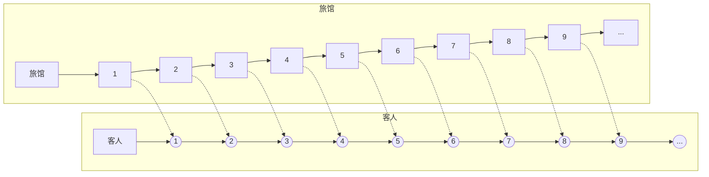

# Mathmap Plan

If you want to build a math world, what would you start with ?

<!-- more -->

The first three most important things I think must be :

1. Natural number, and we’re going to start to re-understand it with Peano axioms
2. Natural logarithm of $e$
3. And $\pi$

All of the three can be described as *Eula’s fomula* :
$$
e^{ix} = \cos x + i\sin x
$$
And the special situation is :
$$
e^{i\pi} + 1 = 0
$$


[Natural number](https://en.wikipedia.org/wiki/Natural_number) -> [Integer](https://en.wikipedia.org/wiki/Integer) -> [Rational number](https://www.wikiwand.com/en/Rational_number) -> [Real number](https://en.wikipedia.org/wiki/Real_number) -> [Complex number](https://en.wikipedia.org/wiki/Complex_number)


已知的数学分支：

- Number theory
- Geometry
- Algebra，其中需要掌握的有group theory, field theory, vector spaces and linear algebra, boolean algebra
- Calculus and analysis，其中Integration, measure theory and potential theory都与probability theory on a continuum密切相关
- Discrete mathematics，Graph theory, Game theory
- Mathematical logic and set theory，参见[Cantor's diagonal argument](https://en.wikipedia.org/wiki/Cantor%27s_diagonal_argument)
- Statistics and other decision sciences，重点关注optimization, operations research, control theory

## 数轴上取任意一点

这个数为有理数的概率为0，为无理数的概率为1

所有有理数构成的集合是一个零测集[Null set](https://en.wikipedia.org/wiki/Null_set)

**可数无穷** $\aleph_0$

希尔伯特旅馆：

将无穷多个房间一一编号，然后给客人安排房间

将这些客人的与房间一一对应，也就是可以将所有的房间看作一个集合，客人当作一个个正整数，让它们形成一一对应的映射



当新来客人时，所有的客人只需按照序号往后移一位即可为新来的客人腾出空的1号房间

也即：

$$
\aleph_0 + 1 = \aleph_0
$$

同理：

$$
\aleph_0 + k = \aleph_0
$$

将上述规律扩展到整数，只需将编号为$x$的客人搬到编号为$2x$的房间中，这样就能为对应的自然数以外的客人腾出奇数号的房间，即：

$$
\aleph_0 +\aleph_0 = \aleph_0\\
2\times \aleph_0 = \aleph_0
$$

由此可以看出，正整数和整数是一样多的，无穷集中，**整体等于部分**


接下来，尝试：
$$
\begin{bmatrix}
(1,1)&(1,2)&(1,3)&(1,4)&(1,5)&(1,6)&(1,7)&(1,8)&(1,9)&\cdots\\
(2,1)&(2,2)&(2,3)&(2,4)&(2,5)&(2,6)&(2,7)&(2,8)&(2,9)&\cdots\\
(3,1)&(3,2)&(3,3)&(3,4)&(3,5)&(3,6)&(3,7)&(3,8)&(3,9)&\cdots\\
(4,1)&(4,2)&(4,3)&(4,4)&(4,5)&(4,6)&(4,7)&(4,8)&(4,9)&\cdots
\end{bmatrix}
$$
将这样一个阵列的客人安排进旅馆，即有限个旅游团的客人，每个旅游团都有无穷多个客人

可以采用康托的[对角论证法](https://en.wikipedia.org/wiki/Cantor%27s_diagonal_argument)，这是乔治·康托尔于1891年提出的用于说明实数集合是不可数集的证明
$$
\aleph_0 \times \aleph_0 = \aleph_0
$$


由这个式子可以得知，任意有限次数的$\aleph_0$都是$\aleph_0$
$$
\aleph_0^x = \aleph_0
$$
其中$x$为实数(?以我的知识水平还不能保证)

**精妙的证明**
$$
\begin{bmatrix}
1/1&1/2&1/3&1/4&1/5&1/6&1/7&1/8&1/9&\cdots\\
2/1&2/2&2/3&2/4&2/5&2/6&2/7&2/8&2/9&\cdots\\
3/1&3/2&3/3&3/4&3/5&3/6&3/7&3/8&3/9&\cdots\\
4/1&4/2&4/3&4/4&4/5&4/6&4/7&4/8&4/9&\cdots
\end{bmatrix}
$$
这样，我们就找到了所有有理数的编号，对于其中相等的分数，我们只取分子分母互质的一个：
$$
\begin{bmatrix}
1/1&1/2&1/3&1/4&1/5&1/6&1/7&1/8&1/9&\cdots\\
2/1&    &2/3&     &2/5&     &2/7&    &2/9&\cdots\\
3/1&3/2&    &3/4&3/5&     &3/7&3/8&     &\cdots\\
4/1&    &4/3&    &4/5&     &4/7&     &4/9&\cdots
\end{bmatrix}
$$
然后我们再用康托三角形的方式安排进旅馆，就可以给有理数一个唯一的编号


**不可数无穷**


设想有无穷多个房间的希尔伯特的旅馆，现在每个房间都有开灯和不开灯两种状态，那么对于这可数无穷多个旅馆$\aleph_0$有$2^{\aleph_0}$种状态，我们以二进制的状态来记录每一种情况，这样的每一种情况形如:
$$
0.10010111110000011010101111\cdots
$$

用下面的脚本转换成十进制小数


```python
# This is a script for a binary number transformed to a decimal number

binary_string = '0.10010111110000011010101111'
int_part, frac_part = binary_string.split('.')
int_part_decimal = int(int_part, 2)
frac_part_decimal = sum(int(bit) * 2**(-i-1) for i, bit in enumerate(frac_part))
decimal_number = int_part_decimal + frac_part_decimal

print(f"十进制数: {decimal_number}")
```

我们将每一个二进制小数都写成十进制，如上面这个示例的小数，其值
$$
\approx 0.5927989333868027
$$


$$
2^{\aleph} \ne \lim_{n \to \infty}2^{n}
$$


连续线段上的所有实数点：$2^{\aleph_0}$


上面一根较短的线段，势为$2^{\aleph_0}$，下面一根长度为其2倍的线段，势为$2\times 2^{\aleph_0} = 2^{\aleph_0+1}$，由上面我们得到的性质，可以得知这两根线段的势是相等的


在这样一条有限长的弧线和无限长的直线中，它们依然有相同的势

同理，对于一个二维的阵列$X$，它的势为
$$
2^{\aleph_0}\times2^{\aleph_0} = 2^{2\aleph_0} = 2^{\aleph_0}
$$
另外一种思路，建立二维图形与一维线段的一一对应：

取出其中一个点的横纵坐标$(x,y)$，我们将这两个坐标的每一位都分开，然后让这两个坐标的数字隔一个穿插进去，形成一个新的小数，以此来定位到这个0到1的长度的线段的位置

不可数无穷的集合可见[康托尔集](https://en.wikipedia.org/wiki/Cantor_set)


康托尔集按照上面的旅馆房间开关灯很好理解，我们把这三段分别标为`0`, `1`, `2`，然后抠掉其中的`1`，这实际上不就是二进制吗？最后康托尔集会形成无穷多个点，而这每一个点都是可以从下往上溯源的，反过来从上往下去对应每一个点，都面临一次二选一的选择

这两段无限可分的线段，每一次的分割，我们从纵向看从上往下，每一行正是代表着希尔伯特的旅馆中的按序列增长的房间
$$
P = \lim _{x\to\infty}\left(\frac{2}{3}\right)^x = 0
$$
可以发现，从数轴上任意取一个点，这个点在康托尔集中的概率为0

## References

1. [【无痛高数】所有数都是无理数？有关无限所有困惑的答案（上）](https://www.bilibili.com/video/BV1wH4y1D7Lu/)
2. [这是人类可能永远无法回答的数学问题](https://www.bilibili.com/video/BV1Ru411g7Jo/)
3. [Cantor's diagonal argument](https://en.wikipedia.org/wiki/Cantor%27s_diagonal_argument)
4. [Null set](https://en.wikipedia.org/wiki/Null_set)
5. [Cantor set](https://en.wikipedia.org/wiki/Cantor_set)


分形请见：[Mandelbrot set](https://en.wikipedia.org/wiki/Mandelbrot_set) 曼德尔布罗特集

有理数集参见：[高等【树】学：树林里竟然藏着有理数的秘密？](https://www.bilibili.com/video/BV1L8411C78K/)

进一步学习参见：[有理数稠密性以及稠密集](https://zhuanlan.zhihu.com/p/348875663#:~:text=%E6%9C%89%E7%90%86%E6%95%B0%E7%9A%84%E7%A8%A0%E5%AF%86%E6%80%A7%EF%BC%8C%E4%BB%8E,%E5%B0%B1%E6%98%AF%E6%9C%89%E7%90%86%E6%95%B0%E7%9A%84%E7%A8%A0%E5%AF%86%E6%80%A7%E3%80%82)


 **需要了解的数学家**

- 欧几里得
- 欧拉
- 柯西
- 伽罗瓦
- 傅立叶
- 拉普拉斯
- 伯努利
- 黎曼
- 高斯
- 阿贝尔
- 拉格朗日