# Mermaid画图

随着 html 和 JavaScript 的深入学习，越发觉得 Mermaid 的功能强大，网络上关于 Mermaid 画图的教程往往都是新手向的，点到即止，信息密度极低且内容分散，故在此记录平时遇见的Mermaid 语法，积少成多，最后形成一个完整的知识体系，本文中关于平时遇到的问题与查阅到的解决方案都会列在参考链接中，以供快速查看原文

## subgraph的左右问题

查看右边的链接：[Mermaid Subgraphs Laid Out Inconsistently](https://stackoverflow.com/questions/71803509/mermaid-subgraphs-laid-out-inconsistently)

如下面一段代码

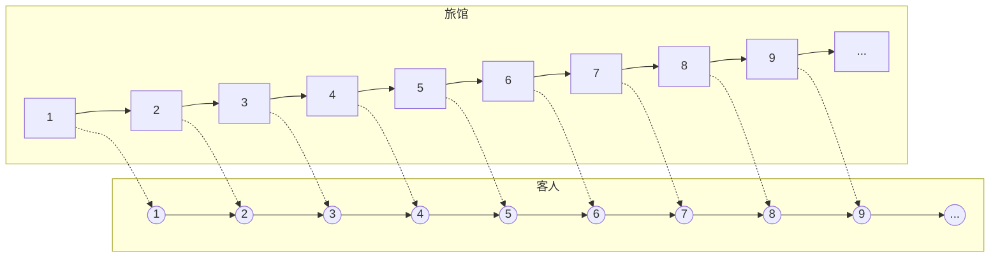

## 其他的Mermaid图

### ER图

E-R图 (Entity Relationship Diagram)，实体-联系图，提供了表示实体类型、属性和联系的方法，用来描述现实世界的概念模型

**关系**

| 左值 | 右值 | 含义        |
| ---- | ---- | ----------- |
| `|o` | `o|` | 0个或1个    |
| `||` | `||` | 有且仅有1个 |
| `}o` | `o{` | 0个或多个   |
| `}|` | `|{` | 1个或多个   |

**示例**

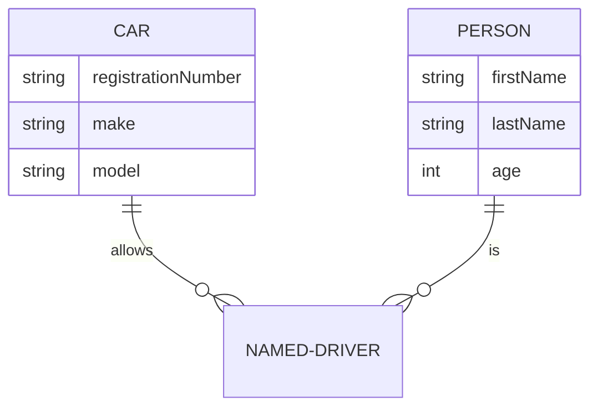

### gantt 甘特图

甘特图，每项任务描述有5个配置，其含义如下

| 位置 | 含义         | 可选值                                                  |
| ---- | ------------ | ------------------------------------------------------- |
| 1    | 是否关键     | `crit/缺省`， crit会展示为红色                          |
| 2    | 状态         | `done/active/缺省`，完成灰色/激活蓝色                   |
| 3    | 别名         | `给定别名/缺省`任务别名                                 |
| 4    | 任务开始时间 | `YYYY-MM-DD/after 其他代号/缺省`                        |
| 5    | 任务结束时间 | `YYYY-MM-DD/持续时长/缺省`，h表示小时，d表示天，w表示周 |

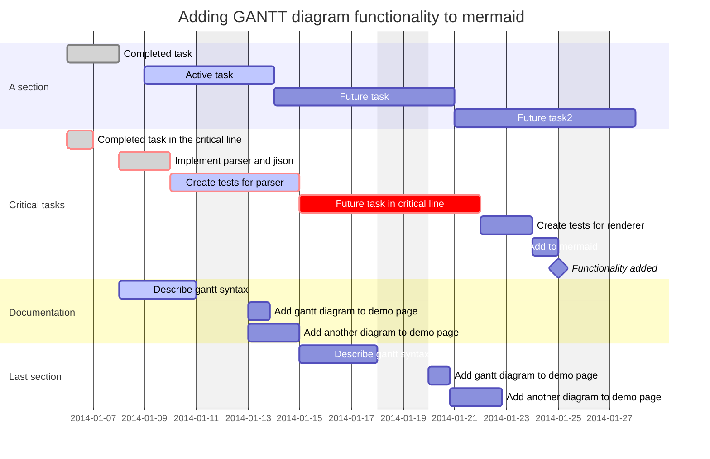

### 饼图

关键字`pie`

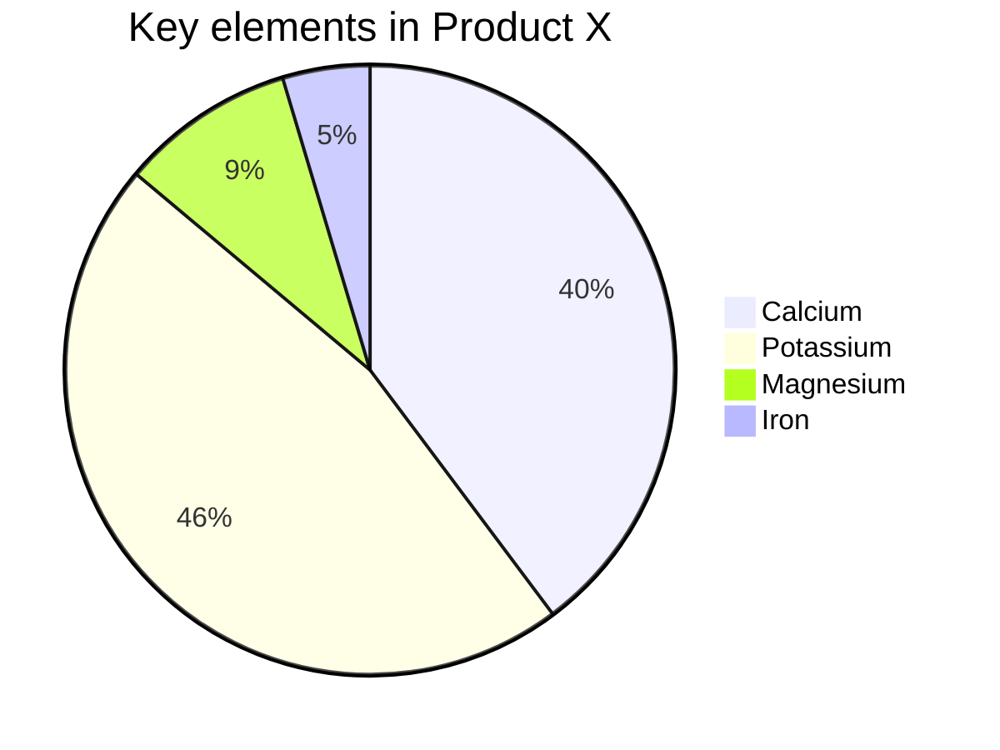

### 时间轴图

关键字`timeline`

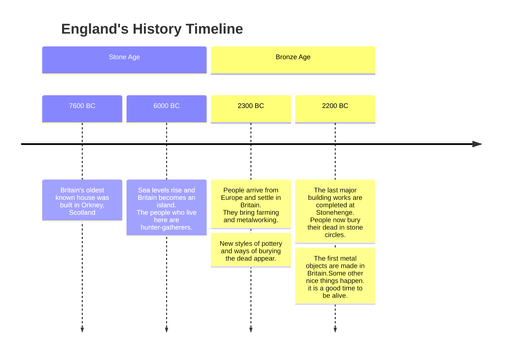

### 类图

类图属于UML中结构图中典型的一种，顾名思义，类图是用来描述类的，因此叫 class diagram ，由很多静态的说明性模型元素组成

使用`mermaid`绘制以说明类图

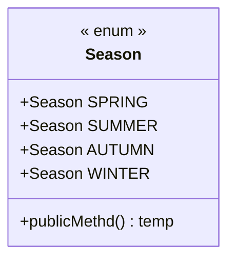

#### 元素

**类元素**

访问修饰符，用于表示类元素的可见范围

| 符号 | 含义               |
| ---- | ------------------ |
| `+`  | `public`           |
| `-`  | `private`          |
| `#`  | `protected`        |
| `~`  | `package/friendly` |
| `$`  | `static`           |
| `*`  | `abstract`         |
| `~~` | 泛型               |

**类注释**

用来标记一个类的元素据，以`<<`开始，`>>`结束，在html中，需要开关前后有一个空格即`<< interface >>`，常用的如下

| 符号              | 类型      |
| ----------------- | --------- |
| `<<interface>>`   | 接口      |
| `<<abstract>>`    | 抽象类    |
| `<<service>>`     | service类 |
| `<<enumeration>>` | 枚举      |

元素据可以是自定义的任何内容

#### 类关系

**继承**

类继承另一个类或接口继承另一个接口

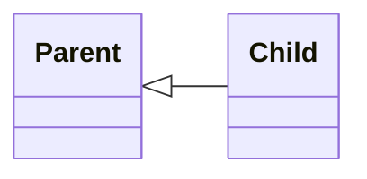

**实现**

类实现接口

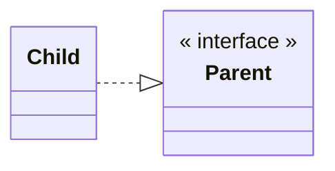

**关联**

表示一种`拥有`的关系，A类作为B类的成员变量，若B类也使用了A类作为成员变量则为双向关联

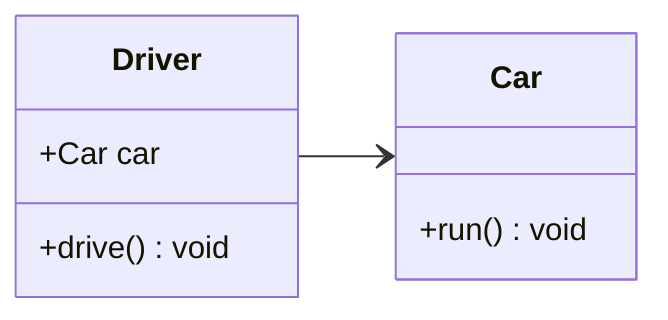

**依赖**

表示一种`使用`的关系，参数依赖、局部变量、静态方法/变量依赖

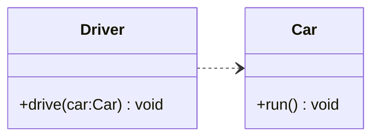

**聚合**

是一种强关联关系，在代码语法上与关联无法区分

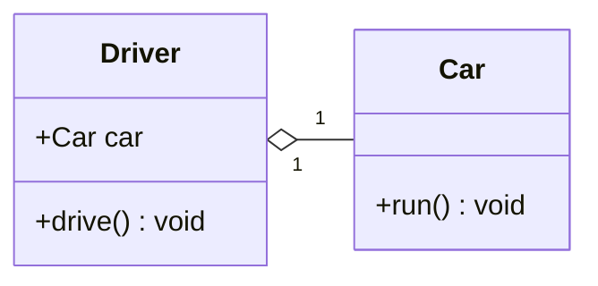

**组合**

也是一种强关联关系，比聚合关系还要强

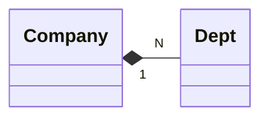

**综合图**

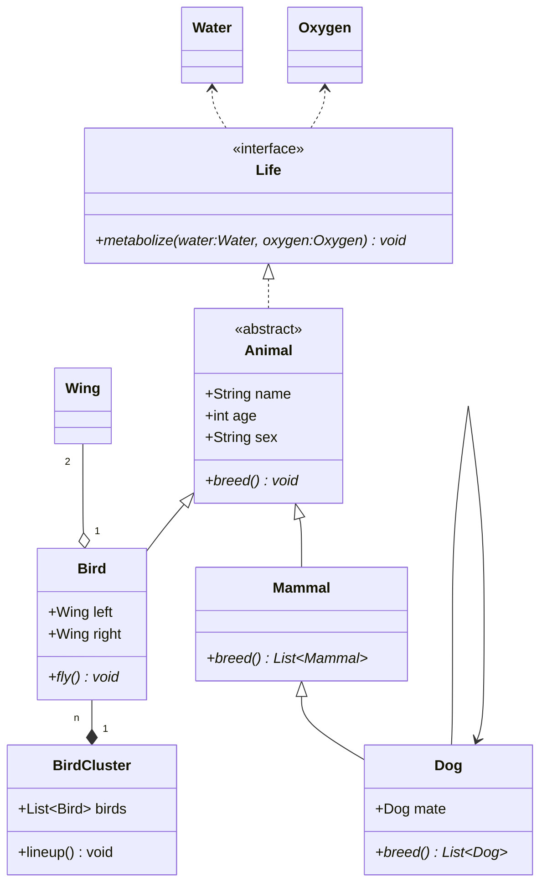

## References

1. [https://xsaxy.gitee.io/docs/markdown/扩展语法超集-Mermaid-流程图](https://xsaxy.gitee.io/docs/markdown/扩展语法超集-Mermaid-流程图)
2. [Mermaid Subgraphs Laid Out Inconsistently](https://stackoverflow.com/questions/71803509/mermaid-subgraphs-laid-out-inconsistently)
3. https://mermaid.js.org/intro/