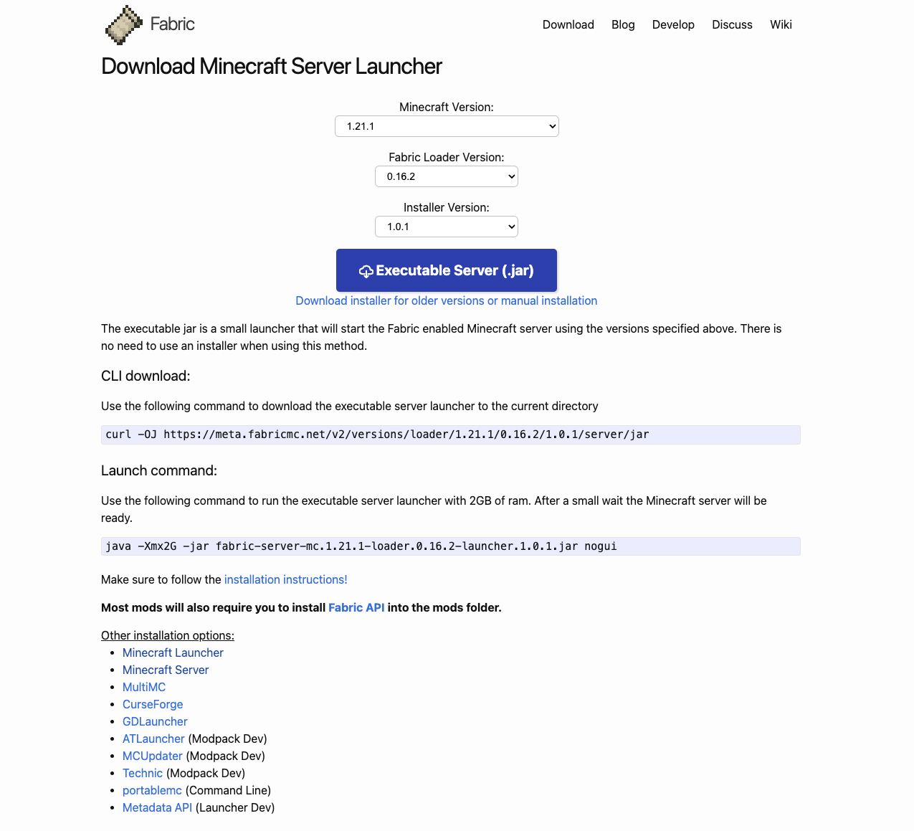

# 搭建MC服务器

这几天一直在高强度玩 Minecraft，于是就突然想在我的 ARM Linux 上开个服务器玩玩，结果一查资料发现开启其实很简单，但是要掌握服务器状态、自由修改服务器的版本模组等、以及服务器的维护并不是一个简单的事。私以为开好一个 MC 服务器不亚于一场计算机与网络知识应用的练习，那么就尝试一下吧

!!! info

    本教程使用的是 Linux 平台的 Ubuntu 系统，所有操作均在命令行中以命令的形式操作，因此具有一定门槛，但是胜在操作方便快捷，基本只需复制粘贴，且能够最大限度地发挥计算机的性能。想要查看 Windows 服务器版本的教程请移步 [【SherkHol】我的世界mod服务器开设教程 模组服 新手简单易学，Java版通用，内网穿透 - 服务器系列#2](https://www.bilibili.com/video/BV1Fv41147kb/)

<!-- more -->

## 安装依赖

由于`Java`的运行环境是`JVM`(Java virtual machine)，因此它有着可以在全平台运行的特性，这也是 Java 版 Minecraft 通常被用于构建服务器版本的原因之一。所以，我们需要先在服务器上安装对应版本的 JDK(Java Development Kit)，这里我们需要安装对应版本的 OpenJDK，它是对 Java 的一种官方的开源参考实现，可以认为 OpenJDK 和 OracleJDK 是一样的[^1]。这里我们要安装的 Minecraft 版本为 1.21 ，需要安装的 OpenJDK 对应版本为 JDK 21。注意这里两个软件的版本并不是一一对应的，只是在这里我们要安装的版本号恰好相同，对于你想要安装的 Minecraft 版本，请搜索所要求的对应的 JDK 版本，或按照此教程安装下去查看报错信息，安装报错信息中要求的版本也可

[^1]: 来源：[https://zh.minecraft.wiki/w/Tutorial:%E6%9E%B6%E8%AE%BEJava%E7%89%88%E6%9C%8D%E5%8A%A1%E5%99%A8?variant=zh-cn](https://zh.minecraft.wiki/w/Tutorial:%E6%9E%B6%E8%AE%BEJava%E7%89%88%E6%9C%8D%E5%8A%A1%E5%99%A8?variant=zh-cn)

### 一条命令安装Java

``` shell
# 更新包列表
sudo apt update

# 安装OpenJDK
sudo apt install openjdk-21-jdk
```

安装完成后查看`Java`是否已经被添加到环境变量:

``` shell
java -version
```

### 手动安装Java

如果在执行命令的时候提示`E: Unable to locate package openjdk-21-jdk`，说明这个系统发行版的默认存储库中还没有包含 Java21，这时我们需要手动下载安装

你可以参考中文官方wiki [教程:架设Java版服务器](https://zh.minecraft.wiki/w/Tutorial:%E6%9E%B6%E8%AE%BEJava%E7%89%88%E6%9C%8D%E5%8A%A1%E5%99%A8#%E9%85%8D%E7%BD%AE%E7%8E%AF%E5%A2%83)，也可以按照我下面的步骤操作:

``` shell
# 下载JDK21
wget https://download.oracle.com/java/21/latest/jdk-21_linux-aarch64_bin.tar.gz

# 解压JDK
tar -xzf jdk-21_linux-aarch64_bin.tar.gz
```

这时可以发现当前目录下有一个`jdk-21.0.4`，通过`ls`命令查看具体名称，我们需要将其移动到`/opt`目录下(其实移动到哪都可以，看个人喜好)

``` shell
sudo mv jdk-21.0.4 /opt/
```

编辑`~/.bashrc`文件，随便找个位置添加:

```shell
export JAVA_HOME=/opt/jdk-21.0.4
export PATH=$JAVA_HOME/bin:$PATH
```

这里建议使用`vim`编辑，方便快捷:

``` shell
vim ~/.bashrc
```

完成后使用`:wq`保存退出，然后重新加载一下`bash`:

``` shell
source ~/.bashrc
```

然后验证一下是否已经添加进环境变量:

``` shell
$ java -version
java version "21.0.4" 2024-07-16 LTS
Java(TM) SE Runtime Environment (build 21.0.4+8-LTS-274)
Java HotSpot(TM) 64-Bit Server VM (build 21.0.4+8-LTS-274, mixed mode, sharing)
```

至此，我们的前置工作就已经做完了

## 安装纯净游戏本体

如果你只想要体验纯净版的游戏，不安装任何 mod，那么这将非常轻松

## 安装 Fabric Server

`Fabric`是一个轻量级的 Mod API，有较好的性能，我们需要运行它需要 Fabric API 和 Fabric Loader，其中 Fabric Loader 用于加载 Mod，而 Fabric API 则提供一些基础的接口供开发者使用，允许其他 Mod 注册物品、模型、方块、图形界面等[^2]

[^2]: 来源: [我的世界 Fabric 1.19.3 服务器搭建教程](https://blog.zeruns.tech/archives/699.html)

现在我们进入 [Fabric 官网](https://fabricmc.net/)，在导航栏的 Download 中找到 [Minecraft Server](https://fabricmc.net/use/server/)，如图所示的界面中可以选择对应的版本:

<center>
{ width="800" }
</center>

下面的生成的命令会根据选择的版本而改变，这里我就以最新版本为例:

``` shell
# 创建文件夹并进入
mkdir fabric-server && cd $_
# 下载服务器jar包
curl -OJ https://meta.fabricmc.net/v2/versions/loader/1.21.1/0.16.2/1.0.1/server/jar
```

下载完成后我们就得到了名为`fabric-server-mc.1.21.1-loader.0.16.2-launcher.1.0.1.jar`的服务器启动文件

使用下面的命令启动这个 Java 程序:

``` shell
java -Xmx4G -jar fabric-server-mc.1.21.1-loader.0.16.2-launcher.1.0.1.jar nogui
```

其中`-Xmx4G`参数的含义为设置 JVM 的最大堆内存大小，`4G`指定了堆内存的最大值为4GB。同时也可以设置`-Xms`参数，用于设置堆内存的厨师大小，将这两个参数设为相同数值可以避免在运行时动态调整堆内存大小，以提升性能[^3]

[^3]: [Benefits of Setting Initial and Maximum Memory Size to the Same Value](https://dzone.com/articles/benefits-of-setting-initial-and-maximum-memory-siz)


## References

1. [Minecraft wiki: 教程:架设Java版服务器](https://zh.minecraft.wiki/w/Tutorial:%E6%9E%B6%E8%AE%BEJava%E7%89%88%E6%9C%8D%E5%8A%A1%E5%99%A8?variant=zh-cn)
2. [我的世界 Fabric 1.19.3 服务器搭建教程](https://blog.zeruns.tech/archives/699.html)
3. [在不使用GUI的情况下安装 Fabric Server](https://fabricmc.net/wiki/zh_cn:player:tutorials:install_server)
4. [【SherkHol】我的世界mod服务器开设教程 模组服 新手简单易学，Java版通用，内网穿透 - 服务器系列#2](https://www.bilibili.com/video/BV1Fv41147kb/)
5. [Minecraft高校联盟资料站: 架设服务器（基础）](https://docs.mualliance.cn/zh/dev/server/base)
6. [Getting started with MCSS](https://docs.mcserversoft.com/)