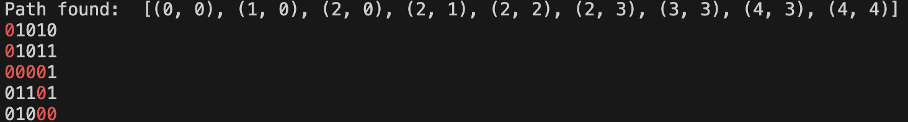

# 🟠 搜索算法

本次对搜索算法的学习主要从两个搜索算法开始：*Depth-first search*, *Breadth-first Search*，也就是DFS和BFC，这两个算法都是图形搜索算法，我们最终都可以把这两种搜索策略用树的形式画出来，这一次我想要在一个简单的图里，使用矩阵来实现一下简单的策略

<!-- more -->

## DFS

现在我们考虑一个这样的矩阵：
$$
\begin{bmatrix}
0&1&0&1&0 \\\\
0&1&0&1&1 \\\\
0&0&0&0&1 \\\\
0&1&1&0&1 \\\\
0&1&0&0&0
\end{bmatrix}
$$
我们规定`0`是可以走的路，`1`是不可以走的路，假设要从左上角走到右下角，现在我们可以使用深度优先算法找到路径

=== "Python"

    ``` py linenums="1"
    RED = "\033[91m"
    RESET = "\033[0m"

    maze = [
        [0,1,0,1,0],
        [0,1,0,1,1],
        [0,0,0,0,1],
        [0,1,1,0,1],
        [0,1,0,0,0]
     ]

    def dfs(maze, x, y, path, visited):
      if x<0 or y<0 or x>=len(maze) or y>=len(maze[0]) or maze[x][y]==1 or visited[x][y]:
        return False
      path.append((x,y))
      visited[x][y] = True

      if x==len(maze)-1 and y==len(maze[0])-1:
        return True

      # 移动：下，右，上，左
      if (dfs(maze, x+1, y, path, visited) or
        dfs(maze, x, y+1, path, visited) or
        dfs(maze, x-1, y, path, visited) or
        dfs(maze, x, y-1, path, visited)):
      return True

      # 如果都不能移动，则弹出
      path.pop()
      return False

    def solve_maze(maze):
      path = []
      visited = [[False for _ in range(len(maze[0]))] for _ in range(len(maze))]
      if dfs(maze, 0, 0, path, visited):
        return path
      else:
        return None

    def print_path(path):
      for i in range(len(maze)):
        for j in range(len(maze[i])):
          if (i,j) in path:
          print(f"{RED}{maze[i][j]}{RESET}", end="")
        else:
          print(maze[i][j], end="")
      if j == len(maze[i]) - 1:
        print() # print() 函数会默认打印一个 \n

    def main():
      path = solve_maze(maze)
      if path:
        print("Path found: ", path)
        print_path(path)
      else:
        print("No path found.")

    if __name__ == "__main__":
      main()
    ```
    运行以上代码可以得到: 
    { width="800" }
    
=== "C"

    ``` c
    
    ```

## BFS


